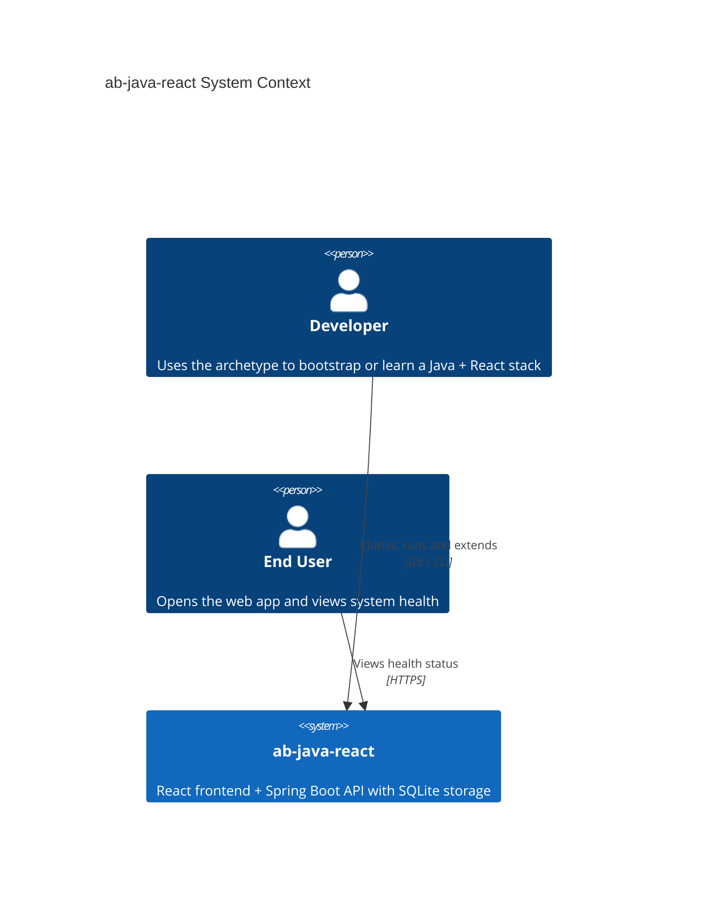

# Agents Instructions

- [SOUL.md](./SOUL.md) captures your personality and boundaries.

## Conventions

- Replace `{placeholders}` when using templates.
- `{slug}`: a short (≤20 chars), readable identifier derived from a title (e.g. `login-page`).

### Environment
- **Git** : https://github.com/AIDDbot/ab-java-react.git - `main`
- **Starting point** : `Greenfield`
- **Monorepo** : `Yes`
- **Tiers** : `[back, front, e2e, db]`

#### Local environment
- **OS** `Windows`
- **Shell** `PowerShell`

### Paths
- **Agents_Folder** — `.agents/`
- **Product_Folder** — `docs/`
- **Rules_Folder** — `.agents/rules/`
- **Source_Folders** — [`back/`, `front/`, `e2e/`]
- **Business_Domain_Language** — `English`

```txt
ab-java-react
├── .agents/      # the agents configuration folder (skills, rules)
├── docs/         # product content: architecture, specs, plans, design
├── back/         # Spring Boot (Java) REST API + SQLite persistence
├── front/        # TypeScript React frontend application
├── e2e/          # TypeScript + Playwright end-to-end test suite
├── AGENTS.md     # project environment, product, and workflow paths
├── SOUL.md       # agent personality, git rules, and boundaries
├── CHANGELOG.md  # the changelog file
├── README.md     # the readme file
```

---

## Product

### Problem
Teams starting a new Java + React project lack a modern, opinionated baseline that wires backend, frontend, persistence, and end-to-end testing together. `ab-java-react` is a reference archetype and sample project: a starting point for new builds and a teaching baseline for courses and workshops. Its initial feature is a Health Check endpoint exposed by the API and rendered by the React frontend.

#### System Context



### Solution
A monorepo with a Spring Boot (Java) REST API in `back/` persisting to an embedded SQLite database, a TypeScript React single-page application in `front/`, and a TypeScript + Playwright end-to-end suite in `e2e/`. Each tier runs independently and uses the latest stable releases and best practices.

### Verification
The product is verified with a Playwright E2E suite that drives the React frontend against a running API and asserts the health check flow end to end.

```bash
# 1. Start the backend API (SQLite auto-provisioned)
cd back; ./mvnw spring-boot:run

# 2. Start the frontend dev server
cd front; npm install; npm run dev

# 3. Run the Playwright E2E suite
cd e2e; npm install; npx playwright test
```
---

> last updated: May 2026
