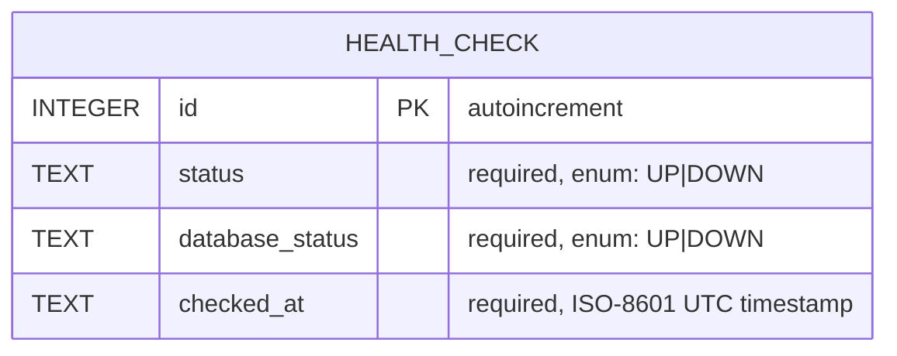

# Domain Model (E-R) — ab-java-react

## Overview

The domain is intentionally minimal for the health-check archetype. A single `HealthCheck` entity records each probe of the system, demonstrating the read/write path to SQLite. It is defined as a JPA entity in the `back` tier (`HealthCheck.java`) and exposed to clients through the `HealthResponse` DTO (Java record / TypeScript type). SQLite is the storage backend.

## E-R Diagram

## Entities — Detail

### HealthCheck

| Field | Type | Constraints |
|-------|------|-------------|
| `id` | INTEGER | PK, auto-increment, not null |
| `status` | TEXT | required, enum (`UP`, `DOWN`) — overall system status |
| `database_status` | TEXT | required, enum (`UP`, `DOWN`) — DB connectivity result |
| `checked_at` | TEXT | required, ISO-8601 UTC timestamp of the probe |

## Relationships and integrity rules

| Relationship | Cardinality | Integrity rule |
|-------------|-------------|----------------|
| (none) | — | `HealthCheck` is a standalone log entity with no foreign keys. |

## Cross-entity business rules

- `status` is `UP` only when `database_status` is `UP`; if the database probe fails, both `status` and `database_status` are `DOWN`.
- `checked_at` is set server-side at probe time and is immutable once persisted (records are append-only; no updates or deletes).
