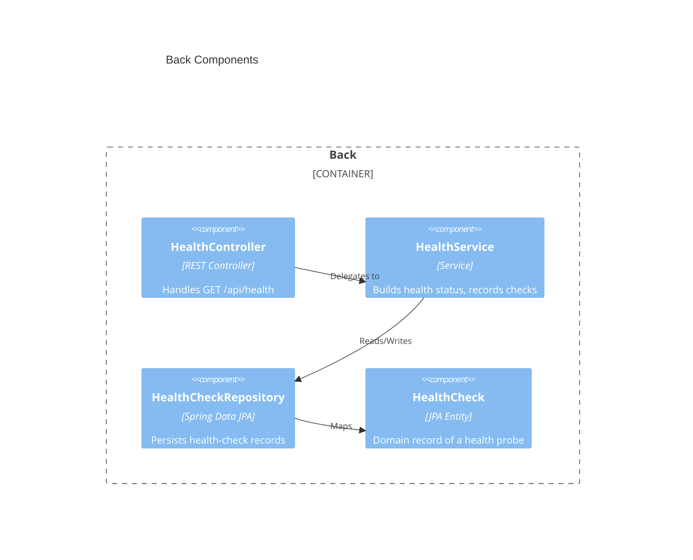
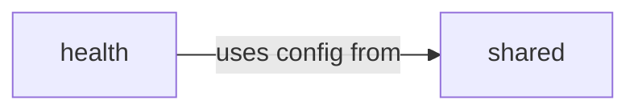

# Back Architecture — ab-java-react

## Overview

The `back` tier is a Spring Boot REST API written in Java that exposes the health check and persists health-check records to an embedded SQLite database. It is the system's single source of truth for application data and the contract provider for the SPA and E2E tiers.

## Technology stack

| Area | Choice |
|------|--------|
| Language | Java 21 (LTS) |
| Framework | Spring Boot 3.4 (Spring Web, Spring Data JPA) |
| Testing | JUnit 5, Spring Boot Test, MockMvc |
| Storage | SQLite (file-based) via JDBC + Hibernate community dialect |
| Security | Public endpoints; CORS allow-list for the SPA origin |
| Logging | SLF4J + Logback (Spring Boot default) |

### Development workflow

| Step | Command |
|------|---------|
| Init | `mvn -N io.takari:maven:wrapper` |
| Build | `./mvnw clean package` |
| Run | `./mvnw spring-boot:run` |
| Test | `./mvnw test` |
| Lint | `./mvnw spotless:check` |
| Deploy | N/A |

---

## Components



### Code organization

**Pattern**: Hybrid — package-by-feature at the top level, layered (controller/service/repository/domain) within each feature.

```text
back/src/main/java/dev/aiddbot/abjavareact/
├── AbJavaReactApplication.java   # Spring Boot entry point
├── health/                       # Health feature package
│   ├── HealthController.java     # REST endpoint GET /api/health
│   ├── HealthService.java        # Status assembly + persistence
│   ├── HealthCheck.java          # JPA entity
│   ├── HealthCheckRepository.java# Spring Data JPA repository
│   └── HealthResponse.java       # Response DTO (record)
└── shared/                       # Cross-feature config (CORS, datasource)
```

### Shared artifacts

| Path | Purpose |
|------|---------|
| `shared/` | Cross-cutting configuration (CORS, web, datasource/dialect beans). |
| `src/main/resources/application.yml` | SQLite datasource URL, JPA/dialect config, server port. |

### Key contracts

| Method | Path | Response |
|--------|------|----------|
| GET | `/api/health` | `200` `{ "status": "UP", "database": "UP", "checkedAt": "<ISO-8601>" }` |

### Dependencies between modules



### Storage infrastructure

Single embedded SQLite file (`data/app.db`) accessed via the `org.xerial:sqlite-jdbc` driver. Hibernate uses the `hibernate-community-dialects` SQLite dialect. Schema is created/updated by JPA (`ddl-auto: update`) for the archetype; a single connection writer is assumed (SQLite single-writer constraint).

> last updated: May 2026
