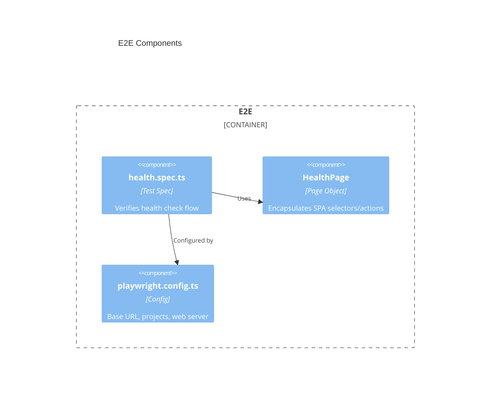
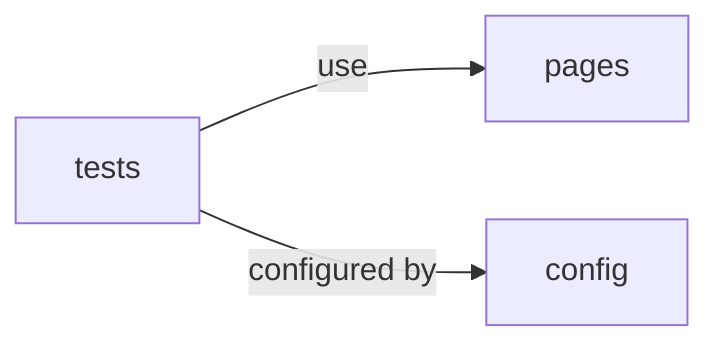

# E2E Architecture — ab-java-react

## Overview

The `e2e` tier is a TypeScript Playwright suite that verifies the full system end to end. It drives the running SPA in a real browser, asserting that the health status is fetched from the API and rendered correctly. It owns no application logic — it validates the integrated behavior of `front` + `back`.

## Technology stack

| Area | Choice |
|------|--------|
| Language | TypeScript 5.x |
| Framework | Playwright Test (`@playwright/test`) |
| Testing | Playwright runner with Chromium/Firefox/WebKit projects |
| Storage | N/A (assertions only) |
| Security | Targets local dev origins; no production credentials |
| Logging | Playwright HTML report, traces, screenshots on failure |

### Development workflow

| Step | Command |
|------|---------|
| Init | `npm init playwright@latest` |
| Build | N/A |
| Run | `npx playwright test` |
| Test | `npx playwright test` |
| Lint | `npm run lint` |
| Deploy | N/A |

---

## Components



### Code organization

**Pattern**: Feature-based — one spec per user-facing flow, with Page Objects encapsulating selectors.

```text
e2e/
├── playwright.config.ts     # Base URL, browser projects, webServer hooks
├── tests/
│   └── health.spec.ts       # Health check end-to-end flow
└── pages/
    └── HealthPage.ts         # Page Object for the health view
```

### Shared artifacts

| Path | Purpose |
|------|---------|
| `playwright.config.ts` | Base URL, browser projects, optional `webServer` to boot front/back. |
| `pages/` | Reusable Page Objects shared across specs. |

### Key contracts

Asserts the user-visible outcome of `GET /api/health`: the SPA displays a status of `UP` and a database status of `UP`. Tests depend on stable, test-friendly selectors (e.g. `data-testid`) exposed by the `front` tier.

### Dependencies between modules



### Storage infrastructure

N/A — the E2E tier persists nothing; Playwright stores transient artifacts (traces, reports, screenshots) under `playwright-report/` and `test-results/`.

> last updated: May 2026
