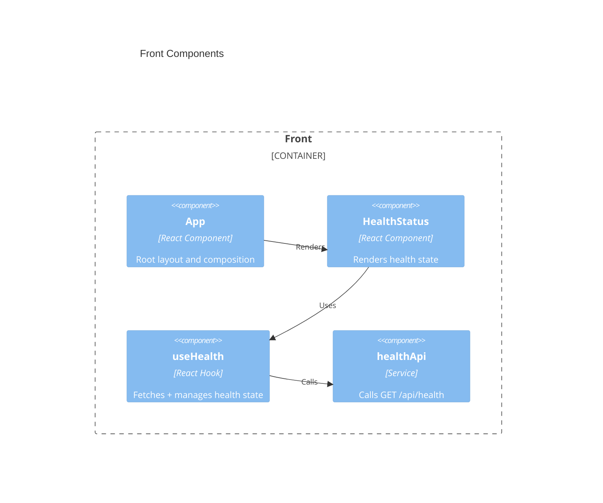

# Front Architecture — ab-java-react

## Overview

The `front` tier is a TypeScript React single-page application built with Vite. It fetches the health status from the backend API and renders it to the user. It owns no persistent state and depends solely on the API's JSON/HTTP contract.

## Technology stack

| Area | Choice |
|------|--------|
| Language | TypeScript 5.x |
| Framework | React 19 + Vite 6 |
| Testing | Vitest + React Testing Library |
| Storage | N/A (stateless; transient fetch state only) |
| Security | Same-origin API calls via configured base URL; no secrets in client |
| Logging | Browser console; error boundary for render failures |

### Development workflow

| Step | Command |
|------|---------|
| Init | `npm create vite@latest front -- --template react-ts` |
| Build | `npm run build` |
| Run | `npm run dev` |
| Test | `npm run test` |
| Lint | `npm run lint` |
| Deploy | N/A |

---

## Components



### Code organization

**Pattern**: Feature-based — each feature owns its components, hooks, and API client; shared primitives live under `shared/`.

```text
front/src/
├── main.tsx              # App bootstrap / React root
├── App.tsx               # Root component
├── features/
│   └── health/
│       ├── HealthStatus.tsx   # Presentational status component
│       ├── useHealth.ts       # Data-fetching hook
│       └── healthApi.ts       # API client for /api/health
└── shared/
    ├── api/httpClient.ts      # fetch wrapper + base URL
    └── types/health.ts        # Shared HealthResponse type
```

### Shared artifacts

| Path | Purpose |
|------|---------|
| `shared/api/httpClient.ts` | Centralized fetch wrapper with API base URL and error handling. |
| `shared/types/health.ts` | TypeScript `HealthResponse` mirroring the API contract. |

### Key contracts

Consumes `GET /api/health`. The `HealthResponse` type is the single source of truth on the client:

```ts
type HealthResponse = {
  status: "UP" | "DOWN";
  database: "UP" | "DOWN";
  uptime: { seconds: number; since: string };
  timestamp: string;
};
```

### Dependencies between features


### Storage infrastructure

N/A — the SPA holds no persistent storage; health data is fetched on demand and kept in component state only.

> last updated: May 2026
