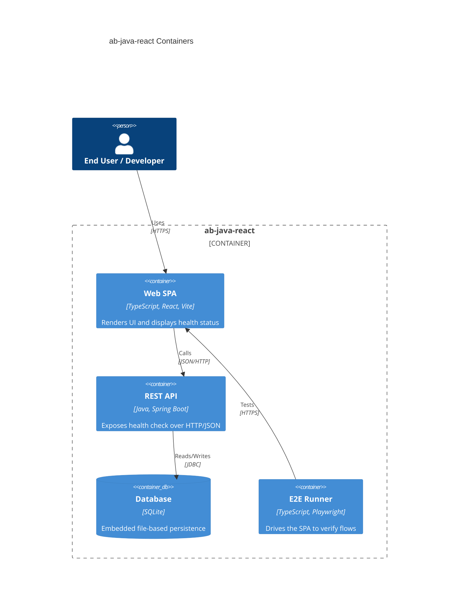

# System Architecture — ab-java-react

## Overview

`ab-java-react` is a modern full-stack archetype and sample project: a React single-page application backed by a Spring Boot REST API with embedded SQLite storage, verified by a Playwright end-to-end suite. It serves as a bootstrap starting point for new projects and a teaching baseline for courses and workshops. Its initial capability is a Health Check exposed by the API and rendered by the frontend.

### Key features

- Health Check REST endpoint reporting API and database status.
- React UI that fetches and displays the health status.
- End-to-end verification of the full flow with Playwright.

### Scope

- A runnable backend API, frontend SPA, embedded SQLite database, and E2E suite.
- Modern, opinionated defaults using current stable releases and best practices.

### Out of scope

- Authentication, authorization, and multi-user features.
- Production deployment, containerization, and CI/CD pipelines.
- Business domain features beyond the health check sample.

---

## System Containers

### Web SPA

Renders the user interface and fetches the health status from the API.
- **Tier**: `front`
- **Folder**: `front/`
- **Archetype**: TypeScript — React + Vite

### REST API

Exposes the health check endpoint and orchestrates persistence.
- **Tier**: `back`
- **Folder**: `back/`
- **Archetype**: Java — Spring Boot (Maven)

### Database

Embedded, file-based relational store for application data.
- **Tier**: `db`
- **Folder**: `back/` (SQLite file, managed by the API)
- **Archetype**: SQLite

### E2E Runner

Drives the running SPA against the API to verify end-to-end flows.
- **Tier**: `e2e`
- **Folder**: `e2e/`
- **Archetype**: TypeScript — Playwright

---

## Inter-container communication

| Source | Target | Protocol | Contract |
|--------|--------|----------|----------|
| Web SPA | REST API | JSON/HTTP | `GET /api/health` returns status payload |
| REST API | Database | JDBC | SQL over SQLite driver |
| E2E Runner | Web SPA | HTTPS | Browser automation against served UI |

> last updated: May 2026
