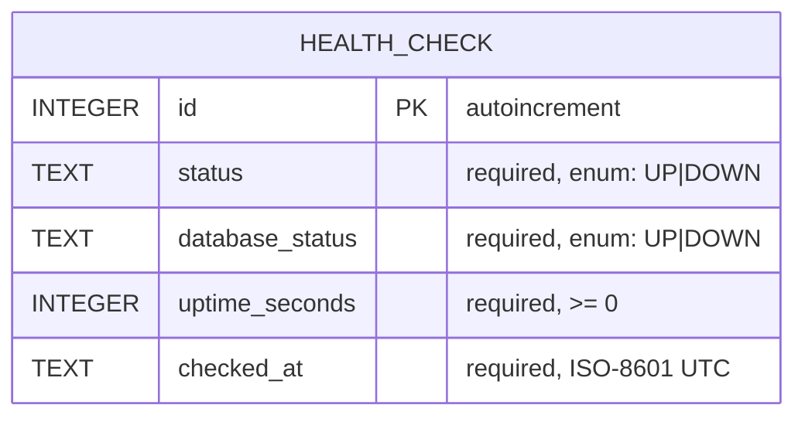

# Specification — Health Check (system vitals, uptime, timestamp)

## Problem definition

Operators, developers using the archetype, and end users have no single, reliable signal that the running system is healthy. They cannot tell at a glance whether the API is responsive, whether its database connection is working, how long the API has been running, or what the server's notion of "now" is. Without these core vitals there is no fast way to confirm a deployment is alive, to detect that a process restarted, or to verify the API↔DB path end to end.

This is the archetype's first feature: a Health Check that reports the core vitals of the whole system — overall status, database connectivity, process uptime, and the current server timestamp — exposed by the API and rendered by the React frontend.

### User Stories

- As an **end user**, I want to **open the web app and see whether the system is healthy** so that I know the application is operational.
- As a **developer/operator**, I want to **see API and database status, uptime, and the current server time** so that I can confirm the system is alive, detect restarts, and verify the API-to-database path.
- As a **QA/E2E engineer**, I want to **query a stable health endpoint and read it in the UI** so that I can verify the full stack end to end with Playwright.

## Solution overview

A single read-only health probe spans all tiers. The `back` API computes the vitals on each request (probing the database, computing uptime from process start, and stamping the current server time), persists an append-only record of the probe to SQLite, and returns a JSON payload. The `front` SPA fetches this payload on load and renders the vitals, with explicit loading and error states. The `e2e` suite drives the SPA and asserts the rendered vitals.

### Data Model

Extends the existing `HealthCheck` entity (see `docs/arch/ER.md`) to capture the new uptime vital. Records remain append-only (no updates/deletes).

- **HealthCheck**: a single recorded probe of the system.
    - id: integer# (auto-increment)
    - status: enum [UP, DOWN]
    - databaseStatus: enum [UP, DOWN]
    - uptimeSeconds: integer [0, ∞]
    - checkedAt: timestamp (ISO-8601 UTC, server-side at probe time)
    - Rules:
      - `status` is `UP` only when `databaseStatus` is `UP`; if the database probe fails, both `status` and `databaseStatus` are `DOWN`.
      - `uptimeSeconds` is the whole seconds elapsed since the API process started, measured at probe time.
      - `checkedAt` is set server-side and is immutable once persisted.

### Backend API

Single endpoint; public, no authentication.

| Method | Path | Success | Body |
|--------|------|---------|------|
| GET | `/api/health` | `200 OK` (status `UP`) / `503 Service Unavailable` (status `DOWN`) | JSON payload below |

Response contract (the single source of truth for the SPA's `HealthResponse` type):

```json
{
  "status": "UP",
  "database": "UP",
  "uptime": { "seconds": 3725, "since": "2026-05-29T10:00:00Z" },
  "timestamp": "2026-05-29T11:02:05Z"
}
```

- `status` / `database`: `UP` | `DOWN`.
- `uptime.seconds`: whole seconds since API start; `uptime.since`: ISO-8601 UTC start time.
- `timestamp`: current server time (ISO-8601 UTC) at the moment the probe is served — this is the persisted `checkedAt`.
- The probe MUST NOT throw to the client: a failed database check yields `status` and `database` = `DOWN` with HTTP `503`, never a 5xx stack trace.
- Layering follows the prescribed `back` components: `HealthController` → `HealthService` → `HealthCheckRepository` → `HealthCheck` (see `docs/arch/back.arch.md`). Uptime is derived from the application start time captured at boot.

### Frontend Application

Feature `front/src/features/health/` per `docs/arch/front.arch.md`:

- `healthApi.ts` — calls `GET /api/health` via the shared `httpClient`.
- `useHealth.ts` — fetches on mount; exposes `loading`, `error`, and `data` (the vitals).
- `HealthStatus.tsx` — renders the vitals:
  - Overall status indicator (clearly distinguishing `UP` vs `DOWN`).
  - Database status.
  - Uptime, formatted human-readably (e.g. `1h 2m 5s`) from `uptime.seconds`.
  - Current server timestamp (`timestamp`), shown in a readable form.
- `App.tsx` composes `HealthStatus`.
- States: a loading indicator while fetching, and a clear error message if the request fails or returns `DOWN`.
- `shared/types/health.ts` mirrors the API contract.

### Database Schema

SQLite, managed by JPA (`ddl-auto: update`). Adds one column to the existing `HEALTH_CHECK` table.



## Acceptance and Release

- [x] WHEN a client sends `GET /api/health` and the database is reachable, THE API SHALL respond `200 OK` with a JSON body containing `status` = `UP`, `database` = `UP`, an `uptime` object with numeric `seconds` and an ISO-8601 `since`, and an ISO-8601 `timestamp`.
- [x] IF the database probe fails, THEN THE API SHALL respond `503 Service Unavailable` with `status` = `DOWN` and `database` = `DOWN`, and SHALL NOT expose a stack trace to the client.
- [x] THE API SHALL compute `uptime.seconds` as the whole seconds elapsed since the API process started, measured at the time the request is served.
- [x] THE API SHALL set `timestamp` to the current server time in ISO-8601 UTC at the time the request is served.
- [x] WHEN a health probe is served, THE API SHALL persist one append-only `HealthCheck` record capturing `status`, `databaseStatus`, `uptimeSeconds`, and `checkedAt`.
- [x] WHILE the health request is in flight, THE Web SPA SHALL display a loading indicator.
- [x] WHEN the health request succeeds, THE Web SPA SHALL display the overall status, the database status, the uptime in human-readable form, and the current server timestamp.
- [x] IF the health request fails or returns `status` = `DOWN`, THEN THE Web SPA SHALL display a clear, non-empty error or unhealthy state to the user.
- [x] THE E2E suite SHALL drive the SPA against a running API and assert that the rendered health vitals (status, database, uptime, timestamp) are present and reflect a healthy system.

## Verification

All acceptance criteria pass. Verified by the `e2e` Playwright suite (`e2e/tests/health.spec.ts`, 4 tests) driving the live SPA + API, complemented by the `back` unit/slice tests covering API-internal behavior:

| Criterion | Verified by |
|-----------|-------------|
| 200 OK healthy payload | E2E `renders healthy system vitals from the live API`; back `HealthControllerTest.returnsOkWhenHealthy` |
| 503 DOWN, no stack trace | back `HealthControllerTest.returnsServiceUnavailableWhenDown`, `HealthServiceTest.reportsDownWithoutThrowingWhenDatabaseProbeFails`; E2E DOWN UI scenario |
| uptime whole seconds since start | back `HealthServiceTest.computesUptimeAsWholeSecondsSinceStart`; E2E uptime rendered from live API |
| server `timestamp` ISO-8601 UTC | back `HealthServiceTest`; E2E timestamp rendered from live API |
| append-only persistence | back `HealthServiceTest.reportsUpAndPersistsWhenDatabaseReachable`, `HealthCheckRepositoryTest` |
| SPA loading indicator | E2E `shows a loading indicator while the probe is in flight` |
| SPA success render | E2E `renders healthy system vitals from the live API` |
| SPA error/unhealthy state | E2E `shows a clear error state when the probe reports the system is down` / `when the API is unreachable` |
| E2E drives SPA vs live API | E2E suite (`reuseExistingServer` + `webServer` boots `back` + `front`) |
